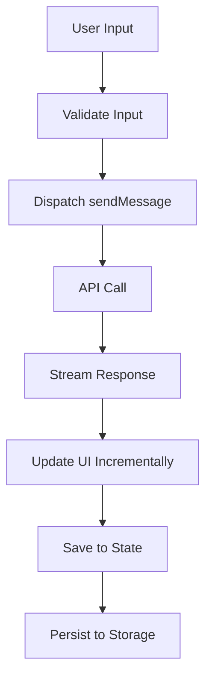
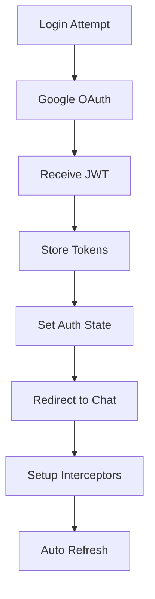
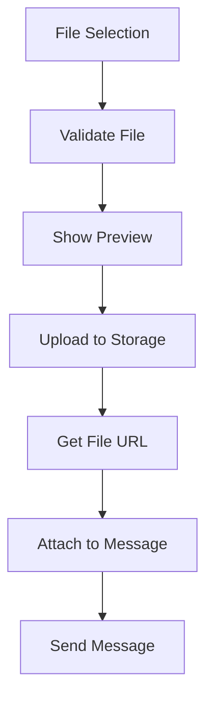

# Arquitetura Técnica - Cognit Studio

## 📋 Índice
1. [Visão Geral da Arquitetura](#visão-geral-da-arquitetura)
2. [Stack Tecnológica](#stack-tecnológica)
3. [Estrutura de Componentes](#estrutura-de-componentes)
4. [Gerenciamento de Estado](#gerenciamento-de-estado)
5. [Fluxo de Dados](#fluxo-de-dados)
6. [APIs e Integrações](#apis-e-integrações)
7. [Segurança](#segurança)
8. [Performance](#performance)
9. [Testes](#testes)
10. [Deploy e DevOps](#deploy-e-devops)

---

## 🏗️ Visão Geral da Arquitetura

### Arquitetura Frontend (SPA)
```
┌─────────────────────────────────────────────────────────┐
│                    COGNIT STUDIO                        │
├─────────────────────────────────────────────────────────┤
│  Presentation Layer (React Components)                 │
│  ┌─────────────┬─────────────┬─────────────────────────┐ │
│  │   Atoms     │  Molecules  │      Organisms          │ │
│  │   - Button  │  - Message  │      - Sidebar          │ │
│  │   - Input   │  - Card     │      - ChatArea         │ │
│  │   - Avatar  │  - Form     │      - Header           │ │
│  └─────────────┴─────────────┴─────────────────────────┘ │
├─────────────────────────────────────────────────────────┤
│  State Management Layer (Redux Toolkit)                │
│  ┌─────────────┬─────────────┬─────────────────────────┐ │
│  │    Auth     │    Chat     │        UI               │ │
│  │  - User     │ - Messages  │    - Theme              │ │
│  │  - Session  │ - Convs     │    - Loading            │ │
│  │  - Perms    │ - Models    │    - Errors             │ │
│  └─────────────┴─────────────┴─────────────────────────┘ │
├─────────────────────────────────────────────────────────┤
│  Service Layer (API Clients)                           │
│  ┌─────────────┬─────────────┬─────────────────────────┐ │
│  │   AuthAPI   │   ChatAPI   │      FileAPI            │ │
│  │ - Login     │ - Send      │    - Upload             │ │
│  │ - Refresh   │ - Stream    │    - Download           │ │
│  │ - Logout    │ - History   │    - Process            │ │
│  └─────────────┴─────────────┴─────────────────────────┘ │
└─────────────────────────────────────────────────────────┘
                            │
                            ▼
┌─────────────────────────────────────────────────────────┐
│                   BACKEND SERVICES                     │
│  ┌─────────────┬─────────────┬─────────────────────────┐ │
│  │   Gateway   │   AI APIs   │      Database           │ │
│  │ - Auth      │ - OpenAI    │    - PostgreSQL        │ │
│  │ - Rate      │ - Claude    │    - Redis Cache       │ │
│  │ - Load      │ - Gemini    │    - File Storage       │ │
│  └─────────────┴─────────────┴─────────────────────────┘ │
└─────────────────────────────────────────────────────────┘
```

---

## 🛠️ Stack Tecnológica

### Frontend Core
- **React 18+** - Framework principal com Concurrent Features
- **TypeScript 5+** - Tipagem estática e IntelliSense
- **Vite** - Build tool e dev server otimizado
- **React Router 6** - Roteamento client-side

### Estado e Dados
- **Redux Toolkit** - Gerenciamento de estado global
- **RTK Query** - Cache e sincronização de dados
- **React Hook Form** - Formulários performáticos
- **Zod** - Validação de schemas

### UI e Estilização
- **CSS Modules** - Estilos encapsulados
- **CSS Custom Properties** - Sistema de design tokens
- **Framer Motion** - Animações fluidas
- **React Virtualized** - Listas grandes otimizadas

### Desenvolvimento
- **ESLint + Prettier** - Qualidade de código
- **Husky + lint-staged** - Git hooks
- **Vitest** - Testes unitários rápidos
- **Testing Library** - Testes de componentes
- **Storybook** - Documentação de componentes

### Build e Deploy
- **Docker** - Containerização
- **Nginx** - Servidor web
- **GitHub Actions** - CI/CD
- **Vercel/Netlify** - Deploy automático

---

## 🧩 Estrutura de Componentes (Atomic Design)

### Atoms (Elementos Básicos)
```typescript
// Componentes fundamentais reutilizáveis
src/components/atoms/
├── Button/
│   ├── Button.tsx
│   ├── Button.module.css
│   ├── Button.types.ts
│   ├── Button.test.tsx
│   └── index.ts
├── Input/
├── Avatar/
├── Icon/
├── Spinner/
└── Badge/
```

### Molecules (Combinações Simples)
```typescript
// Grupos de atoms com funcionalidade específica
src/components/molecules/
├── MessageBubble/
│   ├── MessageBubble.tsx
│   ├── MessageBubble.module.css
│   ├── MessageBubble.types.ts
│   └── index.ts
├── UserCard/
├── FormField/
├── SearchBox/
└── FileUpload/
```

### Organisms (Componentes Complexos)
```typescript
// Seções completas da interface
src/components/organisms/
├── Sidebar/
├── ChatArea/
├── Header/
├── ConversationList/
└── MessageInput/
```

### Templates (Layouts)
```typescript
// Estruturas de página
src/components/templates/
├── ChatLayout/
├── AuthLayout/
└── SettingsLayout/
```

### Pages (Páginas Completas)
```typescript
// Páginas da aplicação
src/pages/
├── Chat/
├── Login/
├── Settings/
└── Profile/
```

---

## 🔄 Gerenciamento de Estado

### Estrutura Redux
```typescript
// Estado global da aplicação
interface RootState {
  auth: AuthState;
  chat: ChatState;
  ui: UIState;
  api: ApiState;
}

// Auth Slice
interface AuthState {
  user: User | null;
  isAuthenticated: boolean;
  token: string | null;
  refreshToken: string | null;
  permissions: Permission[];
  loading: boolean;
  error: string | null;
}

// Chat Slice
interface ChatState {
  conversations: Conversation[];
  activeConversationId: string | null;
  messages: Record<string, Message[]>;
  selectedModel: AIModel;
  availableModels: AIModel[];
  streamingMessage: StreamingMessage | null;
  loading: boolean;
  error: string | null;
}

// UI Slice
interface UIState {
  theme: 'light' | 'dark' | 'auto';
  sidebarCollapsed: boolean;
  notifications: Notification[];
  modals: ModalState;
  loading: Record<string, boolean>;
  errors: Record<string, string>;
}
```

### Padrões de Estado
```typescript
// Actions padronizadas
const chatSlice = createSlice({
  name: 'chat',
  initialState,
  reducers: {
    // Synchronous actions
    setActiveConversation: (state, action) => {
      state.activeConversationId = action.payload;
    },
    addMessage: (state, action) => {
      const { conversationId, message } = action.payload;
      if (!state.messages[conversationId]) {
        state.messages[conversationId] = [];
      }
      state.messages[conversationId].push(message);
    },
  },
  extraReducers: (builder) => {
    // Async actions
    builder
      .addCase(sendMessage.pending, (state) => {
        state.loading = true;
        state.error = null;
      })
      .addCase(sendMessage.fulfilled, (state, action) => {
        state.loading = false;
        // Handle success
      })
      .addCase(sendMessage.rejected, (state, action) => {
        state.loading = false;
        state.error = action.error.message;
      });
  },
});
```

---

## 📊 Fluxo de Dados

### Fluxo de Mensagem


### Fluxo de Autenticação


### Fluxo de Upload


---

## 🔌 APIs e Integrações

### API Client Architecture
```typescript
// Base API client
class ApiClient {
  private baseURL: string;
  private token: string | null = null;

  constructor(baseURL: string) {
    this.baseURL = baseURL;
    this.setupInterceptors();
  }

  private setupInterceptors() {
    // Request interceptor - add auth
    // Response interceptor - handle errors
    // Retry logic for failed requests
  }

  async request<T>(config: RequestConfig): Promise<T> {
    // Implementation
  }
}

// Specialized API clients
class ChatAPI extends ApiClient {
  async sendMessage(data: SendMessageRequest): Promise<Message> {
    return this.request({
      method: 'POST',
      url: '/chat/messages',
      data,
    });
  }

  async streamMessage(data: SendMessageRequest): Promise<ReadableStream> {
    return this.request({
      method: 'POST',
      url: '/chat/stream',
      data,
      responseType: 'stream',
    });
  }
}
```

### WebSocket para Streaming
```typescript
class StreamingService {
  private ws: WebSocket | null = null;
  private reconnectAttempts = 0;
  private maxReconnectAttempts = 5;

  connect(token: string) {
    this.ws = new WebSocket(`wss://api.cognit.studio/stream?token=${token}`);
    this.setupEventHandlers();
  }

  private setupEventHandlers() {
    this.ws.onmessage = (event) => {
      const data = JSON.parse(event.data);
      this.handleStreamChunk(data);
    };

    this.ws.onclose = () => {
      this.handleReconnect();
    };
  }

  private handleStreamChunk(chunk: StreamChunk) {
    store.dispatch(updateStreamingMessage(chunk));
  }
}
```

---

## 🔒 Segurança

### Autenticação e Autorização
```typescript
// JWT Token Management
class TokenManager {
  private static instance: TokenManager;
  private accessToken: string | null = null;
  private refreshToken: string | null = null;

  setTokens(access: string, refresh: string) {
    this.accessToken = access;
    this.refreshToken = refresh;
    this.scheduleRefresh();
  }

  async getValidToken(): Promise<string> {
    if (this.isTokenExpired(this.accessToken)) {
      await this.refreshAccessToken();
    }
    return this.accessToken!;
  }

  private async refreshAccessToken() {
    // Refresh logic
  }
}

// Request sanitization
const sanitizeInput = (input: string): string => {
  return DOMPurify.sanitize(input, {
    ALLOWED_TAGS: ['b', 'i', 'em', 'strong', 'code'],
    ALLOWED_ATTR: [],
  });
};
```

### Content Security Policy
```typescript
// CSP Headers
const cspDirectives = {
  'default-src': ["'self'"],
  'script-src': ["'self'", "'unsafe-inline'", 'https://apis.google.com'],
  'style-src': ["'self'", "'unsafe-inline'", 'https://fonts.googleapis.com'],
  'img-src': ["'self'", 'data:', 'https:'],
  'connect-src': ["'self'", 'https://api.cognit.studio', 'wss://api.cognit.studio'],
  'font-src': ["'self'", 'https://fonts.gstatic.com'],
};
```

---

## ⚡ Performance

### Code Splitting
```typescript
// Route-based splitting
const ChatPage = lazy(() => import('../pages/Chat/Chat'));
const SettingsPage = lazy(() => import('../pages/Settings/Settings'));

// Component-based splitting
const HeavyComponent = lazy(() => import('../components/HeavyComponent'));

// Feature-based splitting
const AdminPanel = lazy(() => 
  import('../features/admin').then(module => ({ default: module.AdminPanel }))
);
```

### Memoization Strategy
```typescript
// Component memoization
const MessageBubble = memo(({ message, user }: MessageBubbleProps) => {
  return (
    <div className={styles.bubble}>
      {/* Component content */}
    </div>
  );
}, (prevProps, nextProps) => {
  // Custom comparison
  return prevProps.message.id === nextProps.message.id &&
         prevProps.message.content === nextProps.message.content;
});

// Hook memoization
const useOptimizedChat = (conversationId: string) => {
  const messages = useSelector(
    (state: RootState) => state.chat.messages[conversationId] || [],
    shallowEqual
  );

  const sortedMessages = useMemo(
    () => messages.sort((a, b) => new Date(a.timestamp).getTime() - new Date(b.timestamp).getTime()),
    [messages]
  );

  return sortedMessages;
};
```

### Virtual Scrolling
```typescript
// For large message lists
const VirtualizedMessageList = ({ messages }: { messages: Message[] }) => {
  const rowRenderer = ({ index, key, style }: any) => (
    <div key={key} style={style}>
      <MessageBubble message={messages[index]} />
    </div>
  );

  return (
    <AutoSizer>
      {({ height, width }) => (
        <List
          height={height}
          width={width}
          rowCount={messages.length}
          rowHeight={80}
          rowRenderer={rowRenderer}
        />
      )}
    </AutoSizer>
  );
};
```

---

## 🧪 Testes

### Estratégia de Testes
```typescript
// Unit Tests - Components
describe('MessageBubble', () => {
  it('renders user message correctly', () => {
    const message = createMockMessage({ sender: 'user' });
    render(<MessageBubble message={message} />);
    
    expect(screen.getByText(message.content)).toBeInTheDocument();
    expect(screen.getByTestId('user-avatar')).toBeInTheDocument();
  });

  it('handles long messages with truncation', () => {
    const longMessage = createMockMessage({ 
      content: 'A'.repeat(1000) 
    });
    render(<MessageBubble message={longMessage} />);
    
    expect(screen.getByText(/A{50}\.{3}/)).toBeInTheDocument();
  });
});

// Integration Tests - Features
describe('Chat Feature', () => {
  it('sends message and receives response', async () => {
    const user = userEvent.setup();
    render(<ChatPage />, { wrapper: TestProviders });
    
    const input = screen.getByPlaceholderText('Type your message...');
    const sendButton = screen.getByRole('button', { name: /send/i });
    
    await user.type(input, 'Hello AI');
    await user.click(sendButton);
    
    expect(screen.getByText('Hello AI')).toBeInTheDocument();
    await waitFor(() => {
      expect(screen.getByText(/AI response/)).toBeInTheDocument();
    });
  });
});

// E2E Tests - User Flows
describe('Complete Chat Flow', () => {
  it('user can login and have conversation', () => {
    cy.visit('/login');
    cy.get('[data-testid="google-login"]').click();
    cy.url().should('include', '/chat');
    
    cy.get('[data-testid="message-input"]').type('Hello{enter}');
    cy.get('[data-testid="message-bubble"]').should('contain', 'Hello');
    cy.get('[data-testid="ai-response"]').should('be.visible');
  });
});
```

### Test Utilities
```typescript
// Test providers
export const TestProviders = ({ children }: { children: React.ReactNode }) => {
  const store = configureStore({
    reducer: rootReducer,
    preloadedState: createMockState(),
  });

  return (
    <Provider store={store}>
      <BrowserRouter>
        <ThemeProvider theme="light">
          {children}
        </ThemeProvider>
      </BrowserRouter>
    </Provider>
  );
};

// Mock factories
export const createMockMessage = (overrides: Partial<Message> = {}): Message => ({
  id: faker.string.uuid(),
  content: faker.lorem.sentence(),
  sender: 'user',
  timestamp: faker.date.recent().toISOString(),
  ...overrides,
});
```

---

## 🚀 Deploy e DevOps

### CI/CD Pipeline
```yaml
# .github/workflows/deploy.yml
name: Deploy to Production

on:
  push:
    branches: [main]

jobs:
  test:
    runs-on: ubuntu-latest
    steps:
      - uses: actions/checkout@v3
      - uses: actions/setup-node@v3
        with:
          node-version: '18'
          cache: 'npm'
      
      - run: npm ci
      - run: npm run lint
      - run: npm run type-check
      - run: npm run test:coverage
      - run: npm run build

  deploy:
    needs: test
    runs-on: ubuntu-latest
    steps:
      - name: Deploy to Vercel
        uses: amondnet/vercel-action@v20
        with:
          vercel-token: ${{ secrets.VERCEL_TOKEN }}
          vercel-org-id: ${{ secrets.ORG_ID }}
          vercel-project-id: ${{ secrets.PROJECT_ID }}
```

### Environment Configuration
```typescript
// Environment variables
interface EnvironmentConfig {
  NODE_ENV: 'development' | 'staging' | 'production';
  API_BASE_URL: string;
  GOOGLE_CLIENT_ID: string;
  WEBSOCKET_URL: string;
  SENTRY_DSN?: string;
  ANALYTICS_ID?: string;
}

// Configuration per environment
const config: Record<string, EnvironmentConfig> = {
  development: {
    NODE_ENV: 'development',
    API_BASE_URL: 'http://localhost:3001',
    GOOGLE_CLIENT_ID: 'dev-client-id',
    WEBSOCKET_URL: 'ws://localhost:3001',
  },
  production: {
    NODE_ENV: 'production',
    API_BASE_URL: 'https://api.cognit.studio',
    GOOGLE_CLIENT_ID: 'prod-client-id',
    WEBSOCKET_URL: 'wss://api.cognit.studio',
    SENTRY_DSN: 'https://sentry.io/...',
    ANALYTICS_ID: 'GA-...',
  },
};
```

### Monitoring e Observabilidade
```typescript
// Error tracking
import * as Sentry from '@sentry/react';

Sentry.init({
  dsn: process.env.REACT_APP_SENTRY_DSN,
  environment: process.env.NODE_ENV,
  integrations: [
    new Sentry.BrowserTracing(),
  ],
  tracesSampleRate: 1.0,
});

// Performance monitoring
const performanceObserver = new PerformanceObserver((list) => {
  list.getEntries().forEach((entry) => {
    if (entry.entryType === 'navigation') {
      analytics.track('Page Load Time', {
        duration: entry.duration,
        page: window.location.pathname,
      });
    }
  });
});

performanceObserver.observe({ entryTypes: ['navigation'] });
```

---

## 📈 Métricas e KPIs

### Performance Metrics
- **First Contentful Paint (FCP)**: < 1.5s
- **Largest Contentful Paint (LCP)**: < 2.5s
- **Cumulative Layout Shift (CLS)**: < 0.1
- **First Input Delay (FID)**: < 100ms
- **Time to Interactive (TTI)**: < 3s

### Business Metrics
- **Message Response Time**: < 2s average
- **User Engagement**: > 80% daily active users
- **Error Rate**: < 1% of all requests
- **Uptime**: > 99.9%
- **User Satisfaction**: > 4.5/5 rating

### Technical Metrics
- **Bundle Size**: < 500KB gzipped
- **Code Coverage**: > 80%
- **Accessibility Score**: > 95 (Lighthouse)
- **Security Score**: A+ (Mozilla Observatory)

---

## 🔄 Roadmap Técnico

### Fase 1 - MVP (4 semanas)
- ✅ Autenticação básica
- ✅ Chat simples
- ✅ Interface responsiva
- ✅ Deploy inicial

### Fase 2 - Funcionalidades Core (6 semanas)
- 🔄 Upload de arquivos
- 🔄 Múltiplos modelos de IA
- 🔄 Histórico de conversas
- 🔄 Busca e filtros

### Fase 3 - Otimizações (4 semanas)
- ⏳ Performance tuning
- ⏳ Acessibilidade completa
- ⏳ PWA features
- ⏳ Offline support

### Fase 4 - Avançado (8 semanas)
- ⏳ Colaboração em tempo real
- ⏳ Plugins e extensões
- ⏳ Analytics avançado
- ⏳ AI model fine-tuning

---

## 📚 Documentação Adicional

- [API Documentation](./api-documentation.md)
- [Component Library](./component-library.md)
- [Deployment Guide](./deployment-guide.md)
- [Contributing Guidelines](./contributing.md)
- [Security Guidelines](./security.md)