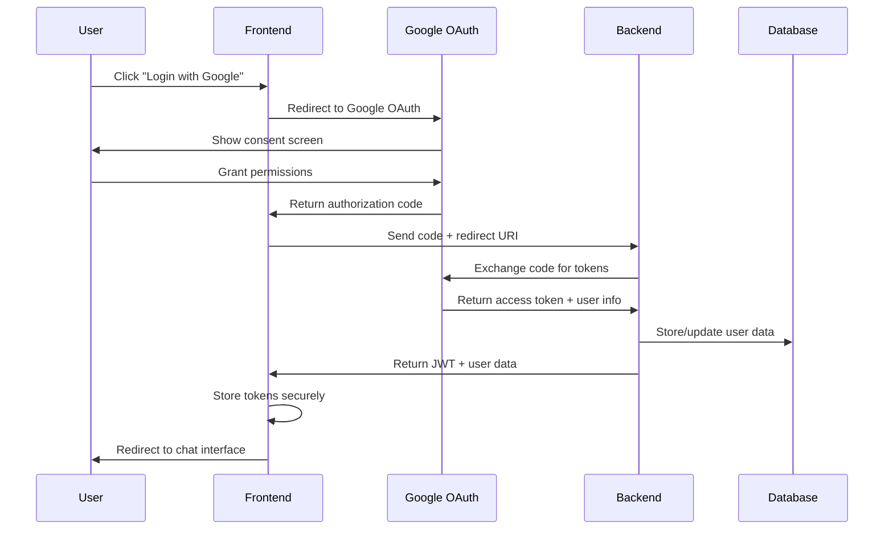
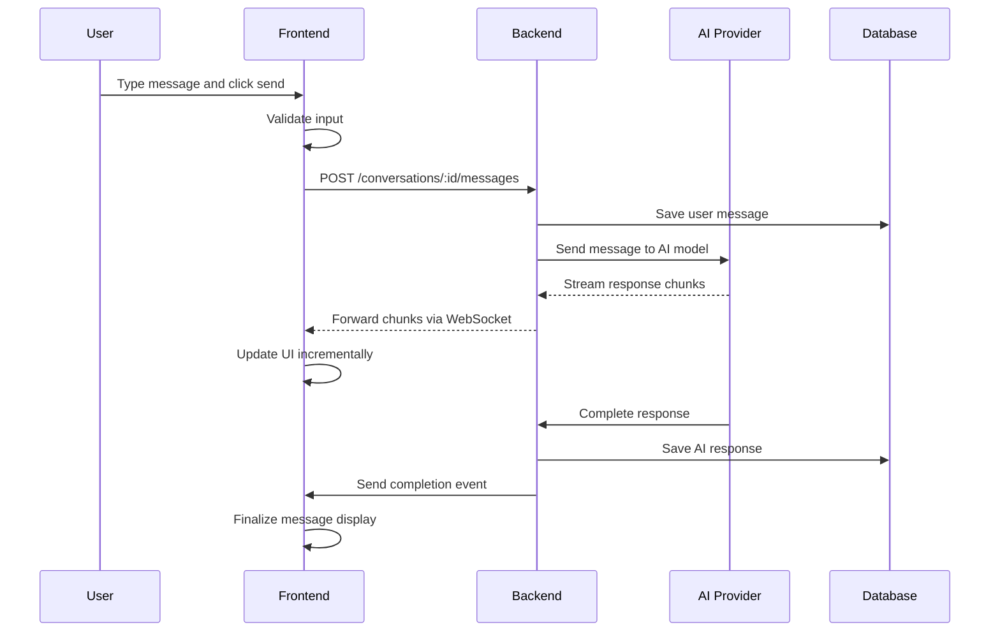
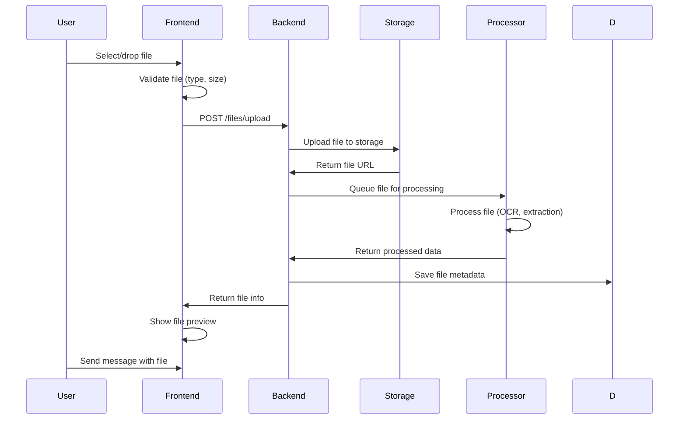

# Especificações Técnicas - Cognit Studio

## 📋 Índice
1. [Requisitos Funcionais](#requisitos-funcionais)
2. [Requisitos Não-Funcionais](#requisitos-não-funcionais)
3. [Arquitetura de Componentes](#arquitetura-de-componentes)
4. [Especificações de API](#especificações-de-api)
5. [Modelos de Dados](#modelos-de-dados)
6. [Fluxos de Trabalho](#fluxos-de-trabalho)
7. [Configurações de Ambiente](#configurações-de-ambiente)
8. [Critérios de Aceitação](#critérios-de-aceitação)

---

## 🎯 Requisitos Funcionais

### **RF001 - Autenticação de Usuário**
**Descrição**: Sistema de autenticação via Google OAuth 2.0
**Prioridade**: Alta
**Complexidade**: Média

#### Especificações Detalhadas:
```typescript
interface AuthenticationRequirements {
  // Login
  googleOAuth: {
    scopes: ['openid', 'email', 'profile'];
    redirectUri: string;
    clientId: string;
  };
  
  // Token Management
  tokenManagement: {
    accessTokenExpiry: 3600; // 1 hour
    refreshTokenExpiry: 2592000; // 30 days
    autoRefresh: boolean;
    secureStorage: boolean;
  };
  
  // Session Management
  sessionManagement: {
    persistentLogin: boolean;
    sessionTimeout: 86400; // 24 hours
    multiDeviceSupport: boolean;
  };
}
```

#### Critérios de Aceitação:
- [ ] Usuário pode fazer login com conta Google
- [ ] Token JWT é armazenado de forma segura
- [ ] Refresh automático de tokens
- [ ] Logout limpa todos os dados de sessão
- [ ] Redirecionamento automático após login/logout

---

### **RF002 - Gestão de Conversas**
**Descrição**: CRUD completo de conversas de chat
**Prioridade**: Alta
**Complexidade**: Alta

#### Especificações Detalhadas:
```typescript
interface ConversationManagement {
  // Operações CRUD
  operations: {
    create: (title?: string) => Promise<Conversation>;
    read: (id: string) => Promise<Conversation>;
    update: (id: string, data: Partial<Conversation>) => Promise<Conversation>;
    delete: (id: string) => Promise<void>;
    list: (filters?: ConversationFilters) => Promise<Conversation[]>;
  };
  
  // Funcionalidades Avançadas
  features: {
    search: {
      fullText: boolean;
      filters: ['date', 'model', 'tags'];
      highlighting: boolean;
    };
    
    organization: {
      favorites: boolean;
      tags: boolean;
      folders: boolean;
      sorting: ['date', 'title', 'activity'];
    };
    
    sharing: {
      publicLinks: boolean;
      teamSharing: boolean;
      permissions: ['read', 'write', 'admin'];
    };
  };
}
```

#### Critérios de Aceitação:
- [ ] Criar nova conversa com título automático ou manual
- [ ] Listar conversas com paginação
- [ ] Buscar conversas por conteúdo
- [ ] Favoritar/desfavoritar conversas
- [ ] Excluir conversas (soft delete)
- [ ] Renomear conversas
- [ ] Filtrar por data, modelo, tags

---

### **RF003 - Sistema de Mensagens**
**Descrição**: Envio, recebimento e gestão de mensagens
**Prioridade**: Alta
**Complexidade**: Alta

#### Especificações Detalhadas:
```typescript
interface MessageSystem {
  // Tipos de Mensagem
  messageTypes: {
    text: {
      maxLength: 32000;
      formatting: ['markdown', 'code', 'links'];
      validation: boolean;
    };
    
    file: {
      supportedTypes: ['image/*', 'application/pdf', 'text/*'];
      maxSize: 50 * 1024 * 1024; // 50MB
      processing: ['ocr', 'text-extraction'];
    };
    
    system: {
      types: ['error', 'info', 'warning'];
      autoHide: boolean;
    };
  };
  
  // Streaming
  streaming: {
    protocol: 'websocket' | 'sse';
    chunkSize: 1024;
    bufferSize: 4096;
    reconnection: {
      maxAttempts: 5;
      backoffStrategy: 'exponential';
    };
  };
  
  // Interações
  interactions: {
    copy: boolean;
    edit: boolean;
    delete: boolean;
    react: boolean;
    regenerate: boolean;
    branch: boolean;
  };
}
```

#### Critérios de Aceitação:
- [ ] Enviar mensagem de texto
- [ ] Upload de arquivos (imagem, PDF, texto)
- [ ] Streaming de respostas em tempo real
- [ ] Copiar conteúdo de mensagens
- [ ] Editar mensagens enviadas
- [ ] Excluir mensagens
- [ ] Regenerar respostas da IA
- [ ] Reagir a mensagens (like/dislike)

---

### **RF004 - Integração com Modelos de IA**
**Descrição**: Suporte a múltiplos provedores de IA
**Prioridade**: Alta
**Complexidade**: Alta

#### Especificações Detalhadas:
```typescript
interface AIModelIntegration {
  // Provedores Suportados
  providers: {
    openai: {
      models: ['gpt-4', 'gpt-4-turbo', 'gpt-3.5-turbo'];
      features: ['text', 'vision', 'function-calling'];
      pricing: 'token-based';
    };
    
    anthropic: {
      models: ['claude-3-opus', 'claude-3-sonnet', 'claude-3-haiku'];
      features: ['text', 'vision', 'long-context'];
      pricing: 'token-based';
    };
    
    google: {
      models: ['gemini-pro', 'gemini-pro-vision'];
      features: ['text', 'vision', 'multimodal'];
      pricing: 'token-based';
    };
  };
  
  // Configurações por Modelo
  modelConfig: {
    temperature: [0, 2];
    maxTokens: [1, 4096];
    topP: [0, 1];
    frequencyPenalty: [-2, 2];
    presencePenalty: [-2, 2];
    systemPrompt: string;
  };
  
  // Rate Limiting
  rateLimiting: {
    requestsPerMinute: number;
    tokensPerMinute: number;
    concurrentRequests: number;
    queueing: boolean;
  };
}
```

#### Critérios de Aceitação:
- [ ] Seleção entre diferentes modelos de IA
- [ ] Configuração de parâmetros por modelo
- [ ] Rate limiting respeitado
- [ ] Fallback entre modelos
- [ ] Exibição de custos estimados
- [ ] Comparação de respostas entre modelos

---

### **RF005 - Upload e Processamento de Arquivos**
**Descrição**: Sistema completo de upload e processamento
**Prioridade**: Média
**Complexidade**: Alta

#### Especificações Detalhadas:
```typescript
interface FileProcessing {
  // Upload
  upload: {
    methods: ['drag-drop', 'click-select', 'paste'];
    validation: {
      fileType: boolean;
      fileSize: boolean;
      virusScan: boolean;
    };
    
    progress: {
      chunked: boolean;
      resumable: boolean;
      realTime: boolean;
    };
  };
  
  // Processamento
  processing: {
    images: {
      formats: ['jpg', 'png', 'gif', 'webp'];
      operations: ['resize', 'compress', 'ocr'];
      maxDimensions: [4096, 4096];
    };
    
    documents: {
      formats: ['pdf', 'docx', 'txt', 'md'];
      operations: ['text-extraction', 'summarization'];
      maxPages: 100;
    };
    
    code: {
      formats: ['js', 'ts', 'py', 'java', 'cpp'];
      operations: ['syntax-highlighting', 'analysis'];
      maxLines: 10000;
    };
  };
  
  // Armazenamento
  storage: {
    provider: 'aws-s3' | 'gcp-storage' | 'azure-blob';
    encryption: 'AES-256';
    retention: 90; // days
    cdn: boolean;
  };
}
```

#### Critérios de Aceitação:
- [ ] Upload por drag & drop
- [ ] Preview de arquivos
- [ ] Barra de progresso
- [ ] Validação de tipo e tamanho
- [ ] OCR para imagens com texto
- [ ] Extração de texto de PDFs
- [ ] Compressão automática
- [ ] URLs seguros para download

---

## ⚡ Requisitos Não-Funcionais

### **RNF001 - Performance**
```typescript
interface PerformanceRequirements {
  // Core Web Vitals
  coreWebVitals: {
    firstContentfulPaint: 1500; // ms
    largestContentfulPaint: 2500; // ms
    firstInputDelay: 100; // ms
    cumulativeLayoutShift: 0.1;
    timeToInteractive: 3000; // ms
  };
  
  // Application Performance
  application: {
    messageResponseTime: 2000; // ms average
    fileUploadSpeed: 10; // MB/s minimum
    searchResponseTime: 500; // ms
    navigationTime: 200; // ms
  };
  
  // Resource Limits
  resources: {
    bundleSize: 500; // KB gzipped
    memoryUsage: 100; // MB maximum
    cpuUsage: 30; // % maximum
    networkRequests: 50; // concurrent maximum
  };
}
```

### **RNF002 - Escalabilidade**
```typescript
interface ScalabilityRequirements {
  // User Load
  userLoad: {
    concurrentUsers: 10000;
    messagesPerSecond: 1000;
    filesPerHour: 5000;
    conversationsPerUser: 1000;
  };
  
  // Data Scaling
  dataScaling: {
    messagesPerConversation: 10000;
    totalMessages: 100000000;
    fileStorageLimit: 1; // TB per user
    searchIndexSize: 10; // GB
  };
  
  // Infrastructure
  infrastructure: {
    autoScaling: boolean;
    loadBalancing: boolean;
    caching: ['redis', 'cdn'];
    monitoring: boolean;
  };
}
```

### **RNF003 - Segurança**
```typescript
interface SecurityRequirements {
  // Authentication & Authorization
  auth: {
    oauth2: boolean;
    jwtTokens: boolean;
    tokenRotation: boolean;
    sessionManagement: boolean;
    multiFactorAuth: boolean; // future
  };
  
  // Data Protection
  dataProtection: {
    encryptionAtRest: 'AES-256';
    encryptionInTransit: 'TLS-1.3';
    dataAnonymization: boolean;
    rightToBeForgotten: boolean;
  };
  
  // Application Security
  appSecurity: {
    contentSecurityPolicy: boolean;
    xssProtection: boolean;
    sqlInjectionProtection: boolean;
    rateLimiting: boolean;
    inputValidation: boolean;
  };
  
  // Compliance
  compliance: {
    gdpr: boolean;
    ccpa: boolean;
    soc2: boolean; // future
    iso27001: boolean; // future
  };
}
```

### **RNF004 - Usabilidade**
```typescript
interface UsabilityRequirements {
  // Accessibility
  accessibility: {
    wcagLevel: 'AA';
    screenReaderSupport: boolean;
    keyboardNavigation: boolean;
    colorContrastRatio: 4.5;
    focusManagement: boolean;
  };
  
  // Internationalization
  i18n: {
    languages: ['en', 'pt-BR', 'es', 'fr'];
    rtlSupport: boolean;
    dateTimeLocalization: boolean;
    numberFormatting: boolean;
  };
  
  // User Experience
  ux: {
    responsiveDesign: boolean;
    mobileFirst: boolean;
    offlineSupport: boolean;
    progressiveWebApp: boolean;
    darkModeSupport: boolean;
  };
  
  // Metrics
  metrics: {
    systemUsabilityScale: 80; // minimum score
    taskCompletionRate: 95; // %
    errorRate: 5; // % maximum
    learnabilityTime: 300; // seconds
  };
}
```

### **RNF005 - Confiabilidade**
```typescript
interface ReliabilityRequirements {
  // Availability
  availability: {
    uptime: 99.9; // %
    plannedDowntime: 4; // hours per month
    recoveryTime: 300; // seconds
    backupFrequency: 'daily';
  };
  
  // Error Handling
  errorHandling: {
    gracefulDegradation: boolean;
    errorBoundaries: boolean;
    retryMechanisms: boolean;
    fallbackStrategies: boolean;
  };
  
  // Monitoring
  monitoring: {
    realTimeAlerts: boolean;
    performanceMetrics: boolean;
    errorTracking: boolean;
    userBehaviorAnalytics: boolean;
  };
  
  // Data Integrity
  dataIntegrity: {
    backupStrategy: '3-2-1';
    checksumValidation: boolean;
    transactionConsistency: boolean;
    dataValidation: boolean;
  };
}
```

---

## 🧩 Arquitetura de Componentes

### **Hierarquia de Componentes**
```typescript
// Atomic Design Structure
interface ComponentArchitecture {
  atoms: {
    Button: {
      variants: ['primary', 'secondary', 'ghost', 'danger'];
      sizes: ['sm', 'md', 'lg'];
      states: ['default', 'hover', 'active', 'disabled', 'loading'];
    };
    
    Input: {
      types: ['text', 'email', 'password', 'search', 'textarea'];
      states: ['default', 'focus', 'error', 'disabled'];
      validation: boolean;
    };
    
    Avatar: {
      sizes: ['xs', 'sm', 'md', 'lg', 'xl'];
      fallback: 'initials' | 'icon';
      status: 'online' | 'offline' | 'away';
    };
  };
  
  molecules: {
    MessageBubble: {
      types: ['user', 'assistant', 'system'];
      features: ['timestamp', 'avatar', 'actions', 'reactions'];
      formatting: ['markdown', 'code', 'links'];
    };
    
    FileUpload: {
      methods: ['drag-drop', 'click', 'paste'];
      preview: boolean;
      progress: boolean;
      validation: boolean;
    };
    
    SearchBox: {
      features: ['autocomplete', 'filters', 'history'];
      debounce: 300; // ms
      minChars: 2;
    };
  };
  
  organisms: {
    Sidebar: {
      sections: ['conversations', 'settings', 'user'];
      collapsible: boolean;
      responsive: boolean;
    };
    
    ChatArea: {
      components: ['header', 'messages', 'input'];
      virtualization: boolean;
      streaming: boolean;
    };
    
    ConversationList: {
      features: ['search', 'filter', 'sort', 'pagination'];
      virtualization: boolean;
      infiniteScroll: boolean;
    };
  };
}
```

### **Props e Estados**
```typescript
// Component Props Specifications
interface ComponentProps {
  // Button Component
  ButtonProps: {
    variant?: 'primary' | 'secondary' | 'ghost' | 'danger';
    size?: 'sm' | 'md' | 'lg';
    disabled?: boolean;
    loading?: boolean;
    icon?: React.ReactNode;
    children: React.ReactNode;
    onClick?: (event: React.MouseEvent) => void;
    type?: 'button' | 'submit' | 'reset';
    'aria-label'?: string;
  };
  
  // MessageBubble Component
  MessageBubbleProps: {
    message: Message;
    user?: User;
    showAvatar?: boolean;
    showTimestamp?: boolean;
    showActions?: boolean;
    onCopy?: (content: string) => void;
    onEdit?: (messageId: string) => void;
    onDelete?: (messageId: string) => void;
    onReact?: (messageId: string, reaction: Reaction) => void;
  };
  
  // ChatArea Component
  ChatAreaProps: {
    conversationId: string;
    messages: Message[];
    loading?: boolean;
    streaming?: boolean;
    onSendMessage: (content: string, files?: File[]) => void;
    onRegenerateResponse: (messageId: string) => void;
  };
}
```

---

## 🔌 Especificações de API

### **Endpoints REST**
```typescript
interface APIEndpoints {
  // Authentication
  auth: {
    'POST /auth/google': {
      body: { code: string; redirectUri: string };
      response: { accessToken: string; refreshToken: string; user: User };
    };
    
    'POST /auth/refresh': {
      body: { refreshToken: string };
      response: { accessToken: string };
    };
    
    'POST /auth/logout': {
      body: { refreshToken: string };
      response: { success: boolean };
    };
  };
  
  // Conversations
  conversations: {
    'GET /conversations': {
      query: { page?: number; limit?: number; search?: string };
      response: { conversations: Conversation[]; total: number };
    };
    
    'POST /conversations': {
      body: { title?: string };
      response: Conversation;
    };
    
    'GET /conversations/:id': {
      params: { id: string };
      response: Conversation;
    };
    
    'PUT /conversations/:id': {
      params: { id: string };
      body: Partial<Conversation>;
      response: Conversation;
    };
    
    'DELETE /conversations/:id': {
      params: { id: string };
      response: { success: boolean };
    };
  };
  
  // Messages
  messages: {
    'GET /conversations/:id/messages': {
      params: { id: string };
      query: { page?: number; limit?: number };
      response: { messages: Message[]; total: number };
    };
    
    'POST /conversations/:id/messages': {
      params: { id: string };
      body: { content: string; files?: string[] };
      response: Message;
    };
    
    'PUT /messages/:id': {
      params: { id: string };
      body: { content: string };
      response: Message;
    };
    
    'DELETE /messages/:id': {
      params: { id: string };
      response: { success: boolean };
    };
  };
  
  // AI Models
  models: {
    'GET /models': {
      response: AIModel[];
    };
    
    'POST /models/:id/chat': {
      params: { id: string };
      body: ChatRequest;
      response: ChatResponse;
    };
    
    'POST /models/:id/stream': {
      params: { id: string };
      body: ChatRequest;
      response: ReadableStream<ChatChunk>;
    };
  };
  
  // Files
  files: {
    'POST /files/upload': {
      body: FormData;
      response: { fileId: string; url: string; metadata: FileMetadata };
    };
    
    'GET /files/:id': {
      params: { id: string };
      response: File;
    };
    
    'DELETE /files/:id': {
      params: { id: string };
      response: { success: boolean };
    };
  };
}
```

### **WebSocket Events**
```typescript
interface WebSocketEvents {
  // Client to Server
  clientEvents: {
    'join-conversation': { conversationId: string };
    'leave-conversation': { conversationId: string };
    'send-message': { conversationId: string; content: string; files?: string[] };
    'typing-start': { conversationId: string };
    'typing-stop': { conversationId: string };
  };
  
  // Server to Client
  serverEvents: {
    'message-chunk': { conversationId: string; messageId: string; chunk: string };
    'message-complete': { conversationId: string; message: Message };
    'message-error': { conversationId: string; error: string };
    'typing-indicator': { conversationId: string; userId: string; typing: boolean };
    'conversation-updated': { conversation: Conversation };
  };
}
```

---

## 📊 Modelos de Dados

### **Entidades Principais**
```typescript
// User Entity
interface User {
  id: string;
  email: string;
  name: string;
  avatar?: string;
  preferences: UserPreferences;
  subscription: Subscription;
  createdAt: Date;
  updatedAt: Date;
  lastActiveAt: Date;
}

interface UserPreferences {
  theme: 'light' | 'dark' | 'auto';
  language: string;
  notifications: NotificationSettings;
  defaultModel: string;
  modelSettings: Record<string, ModelSettings>;
}

// Conversation Entity
interface Conversation {
  id: string;
  userId: string;
  title: string;
  description?: string;
  tags: string[];
  isFavorite: boolean;
  isArchived: boolean;
  settings: ConversationSettings;
  metadata: ConversationMetadata;
  createdAt: Date;
  updatedAt: Date;
  lastMessageAt: Date;
}

interface ConversationSettings {
  model: string;
  temperature: number;
  maxTokens: number;
  systemPrompt?: string;
  allowFileUploads: boolean;
}

// Message Entity
interface Message {
  id: string;
  conversationId: string;
  parentId?: string; // for threading
  type: 'user' | 'assistant' | 'system';
  content: string;
  files: MessageFile[];
  metadata: MessageMetadata;
  reactions: Reaction[];
  createdAt: Date;
  updatedAt: Date;
  editedAt?: Date;
}

interface MessageFile {
  id: string;
  name: string;
  type: string;
  size: number;
  url: string;
  thumbnail?: string;
  metadata: FileMetadata;
}

// AI Model Entity
interface AIModel {
  id: string;
  name: string;
  provider: 'openai' | 'anthropic' | 'google';
  description: string;
  capabilities: ModelCapability[];
  pricing: ModelPricing;
  limits: ModelLimits;
  isActive: boolean;
  version: string;
}

interface ModelCapability {
  type: 'text' | 'vision' | 'function-calling' | 'code';
  description: string;
  supported: boolean;
}
```

### **Relacionamentos**
```typescript
interface DatabaseRelationships {
  // One-to-Many
  userConversations: {
    user: User;
    conversations: Conversation[];
  };
  
  conversationMessages: {
    conversation: Conversation;
    messages: Message[];
  };
  
  messageFiles: {
    message: Message;
    files: MessageFile[];
  };
  
  // Many-to-Many
  userModels: {
    user: User;
    models: AIModel[];
    settings: ModelSettings;
  };
  
  conversationTags: {
    conversation: Conversation;
    tags: Tag[];
  };
}
```

---

## 🔄 Fluxos de Trabalho

### **Fluxo de Autenticação**


### **Fluxo de Envio de Mensagem**


### **Fluxo de Upload de Arquivo**


---

## ⚙️ Configurações de Ambiente

### **Variáveis de Ambiente**
```typescript
interface EnvironmentVariables {
  // Application
  NODE_ENV: 'development' | 'staging' | 'production';
  PORT: number;
  APP_URL: string;
  API_URL: string;
  
  // Authentication
  GOOGLE_CLIENT_ID: string;
  GOOGLE_CLIENT_SECRET: string;
  JWT_SECRET: string;
  JWT_EXPIRES_IN: string;
  REFRESH_TOKEN_SECRET: string;
  REFRESH_TOKEN_EXPIRES_IN: string;
  
  // AI Providers
  OPENAI_API_KEY: string;
  ANTHROPIC_API_KEY: string;
  GOOGLE_AI_API_KEY: string;
  
  // Database
  DATABASE_URL: string;
  REDIS_URL: string;
  
  // Storage
  AWS_ACCESS_KEY_ID: string;
  AWS_SECRET_ACCESS_KEY: string;
  AWS_S3_BUCKET: string;
  AWS_S3_REGION: string;
  
  // Monitoring
  SENTRY_DSN: string;
  ANALYTICS_ID: string;
  LOG_LEVEL: 'error' | 'warn' | 'info' | 'debug';
  
  // Features
  ENABLE_FILE_UPLOAD: boolean;
  ENABLE_STREAMING: boolean;
  ENABLE_ANALYTICS: boolean;
  MAX_FILE_SIZE: number;
  MAX_CONVERSATIONS_PER_USER: number;
}
```

### **Configurações por Ambiente**
```typescript
interface EnvironmentConfigs {
  development: {
    api: {
      baseURL: 'http://localhost:3001';
      timeout: 30000;
      retries: 3;
    };
    
    features: {
      devTools: true;
      hotReload: true;
      mockData: true;
      debugMode: true;
    };
    
    performance: {
      bundleAnalyzer: true;
      sourceMaps: true;
      minification: false;
    };
  };
  
  staging: {
    api: {
      baseURL: 'https://api-staging.cognit.studio';
      timeout: 15000;
      retries: 2;
    };
    
    features: {
      devTools: false;
      hotReload: false;
      mockData: false;
      debugMode: false;
    };
    
    performance: {
      bundleAnalyzer: false;
      sourceMaps: true;
      minification: true;
    };
  };
  
  production: {
    api: {
      baseURL: 'https://api.cognit.studio';
      timeout: 10000;
      retries: 1;
    };
    
    features: {
      devTools: false;
      hotReload: false;
      mockData: false;
      debugMode: false;
    };
    
    performance: {
      bundleAnalyzer: false;
      sourceMaps: false;
      minification: true;
    };
  };
}
```

---

## ✅ Critérios de Aceitação

### **Critérios Gerais**
```typescript
interface AcceptanceCriteria {
  // Funcionalidade
  functionality: {
    allUserStoriesImplemented: boolean;
    allTestsCoverage: number; // minimum 80%
    noBlockingBugs: boolean;
    performanceTargetsMet: boolean;
  };
  
  // Qualidade
  quality: {
    codeReviewApproved: boolean;
    securityScanPassed: boolean;
    accessibilityCompliant: boolean;
    crossBrowserTested: boolean;
  };
  
  // Documentação
  documentation: {
    apiDocumented: boolean;
    componentDocumented: boolean;
    deploymentGuideUpdated: boolean;
    userGuideCreated: boolean;
  };
  
  // Deploy
  deployment: {
    cicdPipelineWorking: boolean;
    environmentsConfigured: boolean;
    monitoringSetup: boolean;
    rollbackPlanTested: boolean;
  };
}
```

### **Critérios por Feature**
```typescript
interface FeatureAcceptanceCriteria {
  authentication: {
    // Functional
    userCanLoginWithGoogle: boolean;
    userCanLogout: boolean;
    tokenRefreshWorks: boolean;
    sessionPersists: boolean;
    
    // Non-functional
    loginTimeUnder3Seconds: boolean;
    tokensStoredSecurely: boolean;
    noSensitiveDataInLogs: boolean;
  };
  
  messaging: {
    // Functional
    userCanSendTextMessage: boolean;
    userCanUploadFiles: boolean;
    streamingResponseWorks: boolean;
    userCanCopyMessages: boolean;
    userCanDeleteMessages: boolean;
    
    // Non-functional
    messageResponseUnder2Seconds: boolean;
    streamingIsSmooth: boolean;
    fileUploadUnder10Seconds: boolean;
    messagesDisplayCorrectly: boolean;
  };
  
  conversations: {
    // Functional
    userCanCreateConversation: boolean;
    userCanRenameConversation: boolean;
    userCanDeleteConversation: boolean;
    userCanSearchConversations: boolean;
    userCanFavoriteConversations: boolean;
    
    // Non-functional
    conversationListLoadsUnder1Second: boolean;
    searchResultsUnder500ms: boolean;
    conversationsPersistCorrectly: boolean;
  };
}
```

---

## 📋 Checklist de Implementação

### **Pré-desenvolvimento**
- [ ] Requisitos funcionais validados
- [ ] Requisitos não-funcionais definidos
- [ ] Arquitetura aprovada
- [ ] Design system criado
- [ ] Ambiente de desenvolvimento configurado

### **Durante Desenvolvimento**
- [ ] Testes unitários escritos
- [ ] Code review realizado
- [ ] Documentação atualizada
- [ ] Performance monitorada
- [ ] Segurança validada

### **Pós-desenvolvimento**
- [ ] Testes de integração passando
- [ ] Testes E2E passando
- [ ] Deploy em staging realizado
- [ ] QA aprovado
- [ ] Performance validada
- [ ] Acessibilidade testada
- [ ] Documentação finalizada

### **Produção**
- [ ] Deploy em produção realizado
- [ ] Monitoring configurado
- [ ] Alertas configurados
- [ ] Backup configurado
- [ ] Rollback plan testado
- [ ] Métricas coletadas
- [ ] Feedback dos usuários coletado

---

## 🎯 Conclusão

Esta especificação técnica fornece uma base sólida para o desenvolvimento do Cognit Studio, cobrindo:

- **Requisitos detalhados** com critérios mensuráveis
- **Arquitetura escalável** com padrões bem definidos
- **APIs bem documentadas** com contratos claros
- **Modelos de dados consistentes** com relacionamentos definidos
- **Fluxos de trabalho otimizados** para melhor UX
- **Configurações flexíveis** para diferentes ambientes
- **Critérios de aceitação claros** para validação

O sucesso da implementação dependerá da aderência rigorosa a estas especificações e da validação contínua dos critérios de aceitação.